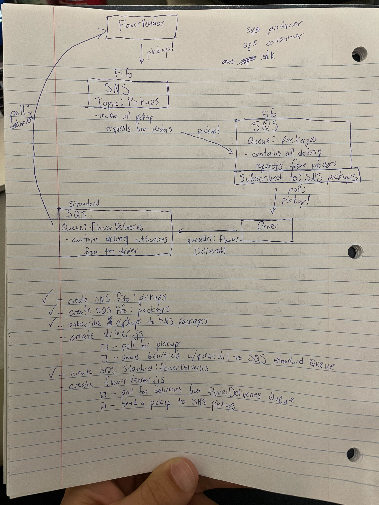
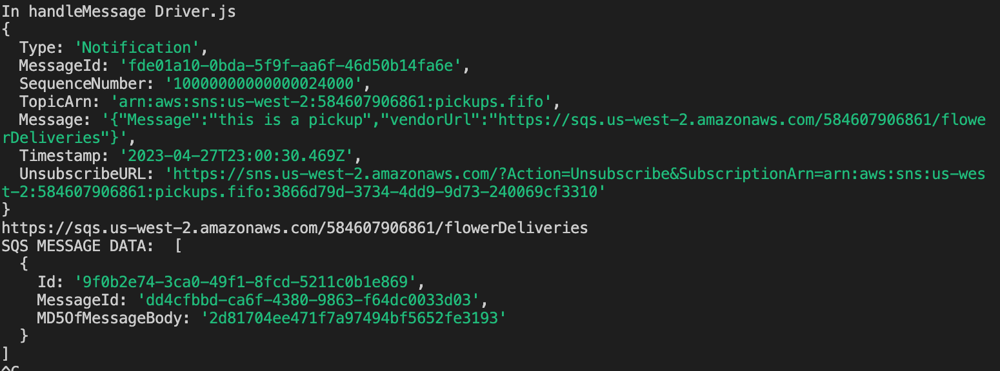
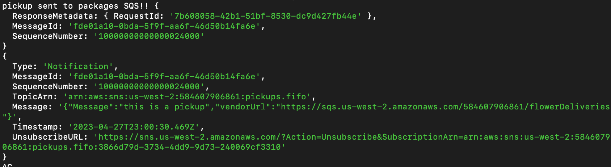

# caps-cloud

- I got the flower vendor to send a pickup message through the pickups SNS (with the flower vendor standard SQS url) to the SQS packages Fifo Queue,
- the queue saves it, then the driver polls the fifo packages queue, takes the url (address that he needs to deliver to) and delivers the message to the standard queue associated to the vendor.
- the vendor then polls the standard queue assiciated with him and sees the driver delivered and console logs what was delivered

